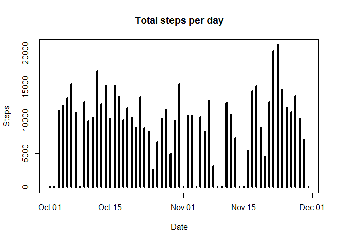
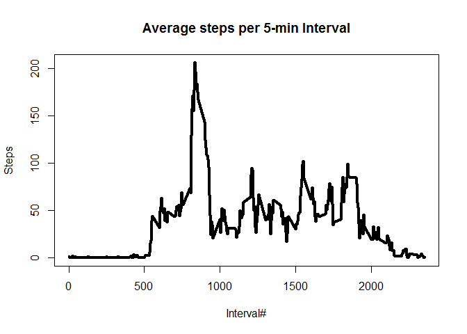
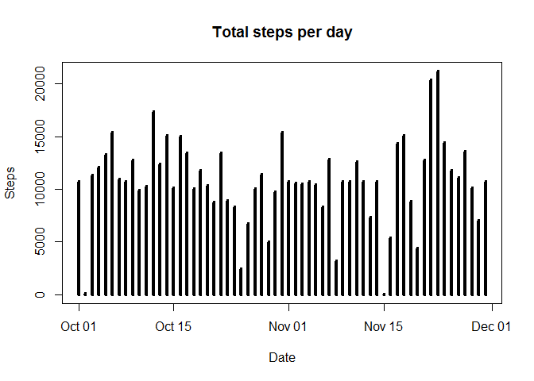

# Reproducible Research: Peer Assessment 1
Ted M  
October 23, 2016  


## Loading and preprocessing the data


```r
# unzip and read the data from the "activity.csv" file, and parse the date field
unzip("repdata%2Fdata%2Factivity.zip")
activity <- read.csv("activity.csv")
activity$date <- as.Date(activity$date, format="%Y-%m-%d")
```

## What is mean total number of steps taken per day?


```r
# summarize the dataframe into daily total activity
suppressPackageStartupMessages(library(dplyr))
dailyActivity <- activity %>% group_by(date) %>% summarize(steps=sum(steps, na.rm=TRUE))
# plot the total steps per day as a histogram
plot(dailyActivity$date, dailyActivity$steps, type="h", lwd=4, main="Total steps per day", xlab="Date", ylab="Steps")
```

<!-- -->

```r
# functions to calculate the mean and median # of steps per day, ignoring NA's
meanstepsperday <- function() {mean(dailyActivity$steps, na.rm=TRUE)}
medianstepsperday <- function() { median(dailyActivity$steps, na.rm=TRUE)}
```
The mean number of steps per day is **9354.2295082**  
The median number of steps per day is **10395**

## What is the average daily activity pattern?


```r
# summarize the data across all days by 5-min interval
meanActivity <- activity %>% group_by(interval) %>% summarize(avgSteps=mean(steps, na.rm=TRUE))
plot(meanActivity$interval, meanActivity$avgSteps, type="l", lwd=4, main="Average steps per 5-min Interval", xlab="Interval#", ylab="Steps")
```

<!-- -->

```r
# function to find the interval# which has the highest average steps
maxAvgStepsInterval <- function() {meanActivity[meanActivity$avgSteps==max(meanActivity$avgSteps, na.rm = TRUE),]$interval}
```
The maximum average number of steps occurs in interval# **835**

## Imputing missing values


```r
# 1. Calculate and report the total number of missing values in the dataset
# function to count the number of steps observations that are NA
naCount <- function() {sum(is.na(activity$steps))}
# 2.Devise a strategy for filling in all of the missing values in the dataset
# derive "imputedSteps", by joining to the meanActivity dataset by interval#,
# then replace missing values with the mean for the interval.
# add "avgSteps" column to activity data
adjusted <- activity %>% left_join(meanActivity, by=c("interval"))
# set the imputedSteps column (integer) to be the first non-NA value of steps, round(avgSteps)
adjusted <- adjusted %>% mutate(imputedSteps = coalesce(steps, as.integer(round(avgSteps))))
# select and rename columns to look like the original dataframe
adjusted <- adjusted %>% select(steps=imputedSteps, date, interval)

#Make a histogram of the total number of steps taken each day and Calculate and report the mean
# and median total number of steps taken per day. Do these values differ from the estimates from
# the first part of the assignment? What is the impact of imputing missing data on the estimates
# of the total daily number of steps?
adjustedDailyActivity <- adjusted %>% group_by(date) %>% summarize(steps=sum(steps, na.rm=TRUE))
# plot the total steps per day as a histogram
plot(adjustedDailyActivity$date, adjustedDailyActivity$steps, type="h", lwd=4, main="Total steps per day", xlab="Date", ylab="Steps")
```

<!-- -->

```r
# functions to calculate the mean and median # of steps per day, ignoring NA's
adjustedmeanstepsperday <- function() {mean(adjustedDailyActivity$steps, na.rm=TRUE)}
adjustedmedianstepsperday <- function() { median(adjustedDailyActivity$steps, na.rm=TRUE)}
```
- The number of observations with missing value is **2304**
- The adjusted mean number of steps per day is **1.0765639\times 10^{4}**  
- The adjusted median number of steps per day is **10762**
- The impact of imputing missing data on the estimates is to: 
- a) increase the mean and median daily steps counts
- b) the Average Steps per 5-min interval remains mostly unchanged


## Are there differences in activity patterns between weekdays and weekends?


```r
# Create a new factor variable in the dataset with two levels -- 
#   "weekday" and "weekend" indicating whether a given date is a weekday or weekend day.
# add a weekday column to the adjusted dataset
adjusted$wday = weekdays(adjusted$date, abbreviate = TRUE)
adjusted[adjusted$wday %in% c("Sat", "Sun"),"dayType"] <- "weekend"
adjusted[!(adjusted$wday %in% c("Sat", "Sun")),"dayType"] <- "weekday"
adjusted$dayType = as.factor(adjusted$dayType)
# 2. Make a panel plot containing a time series plot (i.e. type = "l") of the 5-minute interval (x-axis) 
#    and the average number of steps taken, averaged across all weekday days or weekend days (y-axis). 
meanActivity2 <- adjusted %>% group_by(interval, dayType) %>% summarize(avgSteps=mean(steps, na.rm=TRUE))
library(lattice)
xyplot(avgSteps ~ interval|dayType,meanActivity2, type="l",layout=c(1,2),xlab="Interval",ylab="Number of Steps")
```

<!-- -->
  
  **YES**, there are differences in activity patterns between weekdays and weekends:  
a) the morning activity starts later  
b) the morning activity peak is lower  
c) activity is more even during the day  
